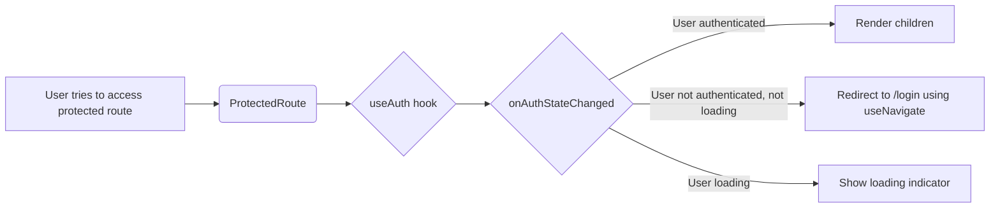

# Route Protection Plan

## Goal

Add functionality to navigate the user to the `/login` page if they try to access any protected route.

## Plan

1.  **Implement `useAuth` hook:**

    - Create a `useAuth` hook in `src/hooks/useAuth.ts` that uses `onAuthStateChanged` to subscribe to authentication state changes.
    - The hook should return the current user and a loading state to indicate whether the authentication status is still being determined.

2.  **Create a `ProtectedRoute` component:**

    - Create a `ProtectedRoute` component that wraps the protected routes.
    - Inside the `ProtectedRoute` component, use the `useAuth` hook to get the current user and loading state.
    - If the user is not authenticated and not loading, redirect them to the `/login` page using `useNavigate` from `react-router-dom`.
    - If the user is loading, show a loading indicator.
    - If the user is authenticated, render the children.

3.  **Modify `src/Routes.ts`:**

    - Wrap the routes in `protectedRoutes` with the `ProtectedRoute` component.

4.  **Test the implementation:**
    - Test accessing protected routes without being logged in.
    - Test accessing protected routes after logging in.
    - Test the logout functionality and ensure that the user is redirected to the `/login` page after logging out.

## Mermaid Diagram

